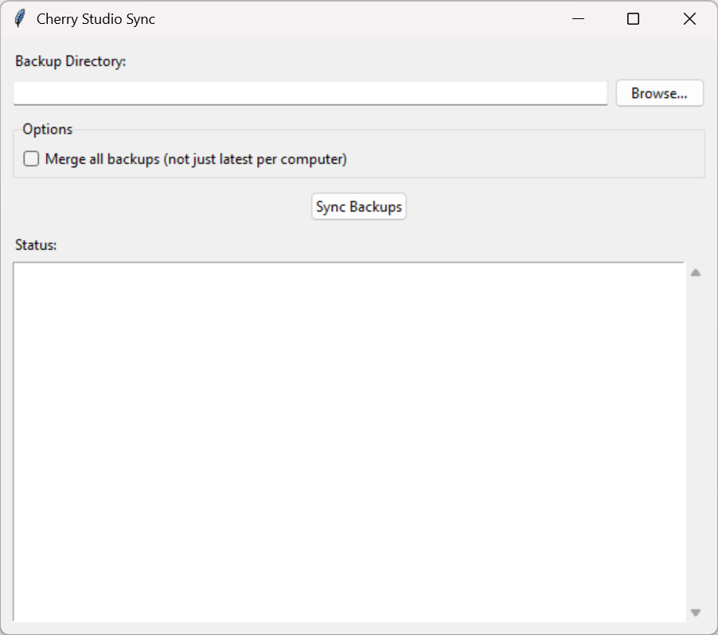

# Cherry Studio Sync

Sync your Cherry Studio data across multiple computers and operating systems.


---

## 🍒 What is Cherry Studio?

[Cherry Studio](https://github.com/CherryHQ/cherry-studio) is a desktop client for Large Language Models (LLMs). It supports multiple AI providers (OpenAI, Anthropic, Google, local models via Ollama, and more) and lets you manage conversations, assistants, knowledge bases, and notes—all in one app.

If you use Cherry Studio on multiple computers (e.g., a work desktop and a personal laptop), you may find that your conversations and assistants don't sync between them. **Cherry Studio Sync** solves this by merging your backup files.

<p align="center">
  
</p>

---

> **Note:** This is a **manual sync tool**, not automatic cloud sync. You'll need to:
> 1. Export backups from each computer
> 2. Run this tool to merge them
> 3. Import the merged backup on each computer

---

## ❌ The Problem

Cherry Studio doesn't sync between devices. When you restore a backup from one computer, it overwrites all data from your current computer. This tool solves that by merging conversation data while keeping each machine's settings intact.

## ⚙️ How It Works

1. **Auto-discovers** backup files in the current directory
2. **Identifies** unique computers from backup filenames
3. **Selects** the latest backup from each computer
4. **Merges** conversation data (assistants, topics, messages)
5. **Creates** a separate merged backup for each computer, with that machine's original settings

### What Gets Synced (Shared Between Computers)
- Assistants and their topics
- Conversation messages
- Knowledge base entries
- Notes and memory

### What Stays Machine-Specific
- Settings (paths, preferences)
- Backup configuration
- Keyboard shortcuts

---

## 📋 Requirements

- Python 3.10+
- Cherry Studio backup files following the naming convention:
  ```
  cherry-studio.<timestamp>.<hostname>.<os>.zip
  ```
  Example: `cherry-studio.20251221172647.my-desktop.windows.zip`

**Note for Linux users:** You may need to install tkinter separately:
- Ubuntu/Debian: `sudo apt-get install python3-tk`
- Fedora: `sudo dnf install python3-tkinter`

---

## 🚀 Usage

### GUI Mode (Recommended for beginners)

The easiest way to use this tool is with the graphical interface:

**Windows:** Double-click `run_gui.bat`

**Mac/Linux:** Run `./run_gui.sh` in terminal (you may need to `chmod +x run_gui.sh` first)

**Or run directly:**
```bash
python cherry_studio_sync.py --gui
```

The GUI provides:
- A directory browser to select your backup folder
- A checkbox for the "merge all" option
- A status log showing progress
- Success/error dialogs when complete

### Command Line Usage (Advanced)

#### Basic Usage

Run the script in your backup directory:

```bash
python cherry_studio_sync.py
```

This will:
1. Find all Cherry Studio backups in the current directory
2. Select the latest backup from each unique computer
3. Create synced backups for each computer

#### Sync All Backups

To include all backups (not just the latest from each computer):

```bash
python cherry_studio_sync.py --all
```

#### Specify Backup Files

To sync specific backup files:

```bash
python cherry_studio_sync.py backup1.zip backup2.zip
```

---

## 📤 Output

The tool creates one synced backup per computer:

```
cherry-studio.<timestamp>.<hostname>.<os>.merged.zip
```

Example output:
```
cherry-studio.20251222085436.macbook.mac.merged.zip
cherry-studio.20251222085436.desktop.windows.merged.zip
```

## 📥 Importing the Synced Backup

1. Open Cherry Studio
2. Go to **Settings** → **Data** → **Restore**
3. Select the synced backup that matches your computer

---

## ⚖️ Conflict Resolution

- **Same conversation on multiple computers**: The most recent version wins (based on timestamps)
- **Deleted conversations**: Items that exist only in older backups are skipped (assumed deleted)
- **New conversations**: Items from the newest backup are always included

## 📝 Example Workflow

1. Export backup from Mac: `cherry-studio.20251220220743.macbook.mac.zip`
2. Export backup from Windows: `cherry-studio.20251221172647.desktop.windows.zip`
3. Copy both to a shared folder (OneDrive, Dropbox, etc.)
4. Run `python cherry_studio_sync.py`
5. Import `cherry-studio.*.macbook.mac.merged.zip` on your Mac
6. Import `cherry-studio.*.desktop.windows.merged.zip` on your Windows PC

Both machines now have all conversations with their respective settings preserved.

---

## ⚠️ Limitations

- Backup files must follow Cherry Studio's naming convention
- Requires at least 2 computers' backups to sync
- Settings sync is intentionally disabled (paths differ between OS)

---

## 🔧 Troubleshooting

### "Python not found" when running launcher scripts

The launcher scripts check for Python in common locations. If Python isn't found:

1. **Install Python 3.10+** from [python.org](https://python.org)
2. **Ensure Python is in your PATH:**
   - Windows: Check "Add Python to PATH" during installation
   - Mac/Linux: Usually automatic with package managers
3. **Alternative:** Install via [uv](https://docs.astral.sh/uv/) or [conda](https://conda.io)

### "tkinter is not available" (Linux)

On some Linux distributions, tkinter is not included by default:

```bash
# Ubuntu/Debian
sudo apt-get install python3-tk

# Fedora
sudo dnf install python3-tkinter

# Arch Linux
sudo pacman -S tk
```

### GUI window doesn't appear (Mac)

On macOS, you may need to grant terminal/Python permission to control the computer in System Preferences > Security & Privacy > Privacy > Accessibility.

---

## 📄 License & Legal

### Open Source License

This project is licensed under the **Mozilla Public License 2.0 (MPL-2.0)**. See the [LICENSE](LICENSE) file for details.

[](https://opensource.org/licenses/MPL-2.0)

### NO WARRANTY DISCLAIMER

**THIS SOFTWARE IS PROVIDED "AS IS" WITHOUT WARRANTY OF ANY KIND, EXPRESS OR IMPLIED, INCLUDING BUT NOT LIMITED TO THE WARRANTIES OF MERCHANTABILITY, FITNESS FOR A PARTICULAR PURPOSE AND NONINFRINGEMENT. IN NO EVENT SHALL THE AUTHOR BE LIABLE FOR ANY CLAIM, DAMAGES OR OTHER LIABILITY, WHETHER IN AN ACTION OF CONTRACT, TORT OR OTHERWISE, ARISING FROM, OUT OF OR IN CONNECTION WITH THE SOFTWARE OR THE USE OR OTHER DEALINGS IN THE SOFTWARE.**

This application is developed and released by an individual developer, not a corporation. By using this software, you acknowledge that:

- The software is provided for free with no guarantees of support, updates, or bug fixes
- The author assumes no liability for any damages, data loss, or issues arising from use of this software
- You use this software entirely at your own risk
- No warranty is provided regarding fitness for any particular purpose

### Source Code Availability

The complete source code for this application is available at:
- GitHub Repository: [https://github.com/lestephen/cherry-studio-sync](https://github.com/lestephen/cherry-studio-sync)

Under MPL 2.0, you have the right to:
- View, download, and study the source code
- Modify the code for your own use
- Distribute modified versions (with proper attribution)
- Use the code in commercial projects (following MPL 2.0 terms)
